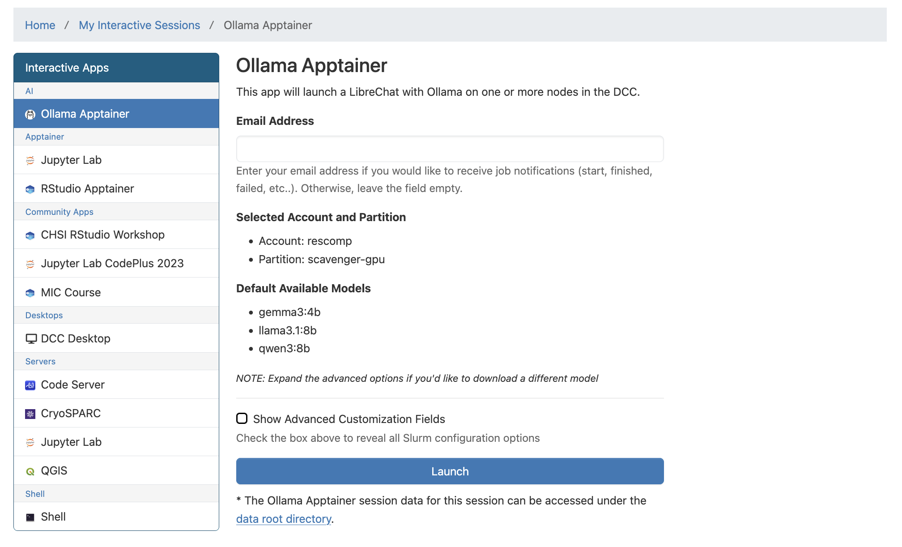
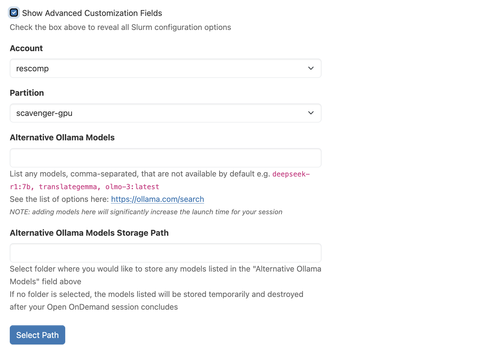
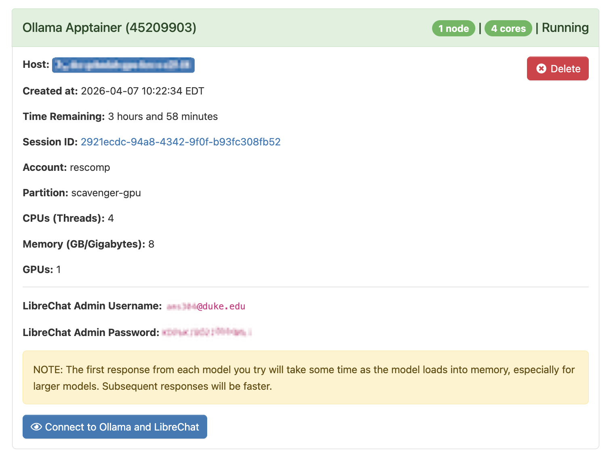
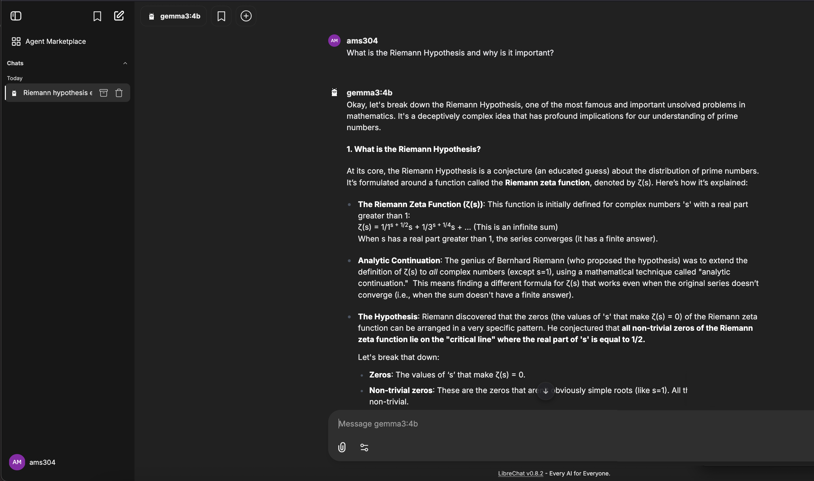

# Batch Connect - Ollama + LibreChat

An Open OnDemand application to launch Ollama and LibreChat. It is designed to work with an Ollama + LibreChat apptainer image, such as the one you can build using [this repository](https://gitlab.oit.duke.edu/flamin-hot/librechat-apptainer).

### Installation and Configuration

This repo is intended to be copied and customized for your site. Below is a quick map of what you are likely to edit.

**Configuration**

The app can read settings from `config.env` in the app directory. If a value is not present in `config.env`, it will fall back to defaults where applicable.

**Config Keys**

- `CLUSTER` (required): your Open OnDemand cluster name. Used by `form.yml.erb`.
- `OOD_BASE_URL` (required): base URL to your Open OnDemand portal (e.g., `https://ondemand.youruniversity.edu`). Used to build LibreChat URLs in `template/script.sh.erb`.
- `OLLAMA_MANIFESTS_DIR` (optional): path to the pre-downloaded Ollama model manifests directory. Default: `/opt/apps/models/ollama-slim/manifests`.
- `GPU_PARTITIONS` (optional): comma-separated list of GPU partitions so that only these partitions will be selectable by user. If unset, all a user's available partitions are shown.
- `DEFAULT_PARTITION` (optional): preferred default partition when GPU filtering is enabled. If unset, falls back to first available partition.
- `EMAIL_DOMAIN` (optional): domain portion for the admin email (e.g., `youruniversity.edu`). Defaults to `example.edu`.

**Key Files To Customize**
1. `config.env`
1. `form.yml.erb`
2. `submit.yml.erb`
3. `form.js`
4. `manifest.yml`
5. `template/`
6. `view.html.erb`

**What To Edit And Why**

**`config.env`**
- This contains the required values that you will need to provide that are unique to your university/organization (see Configuration section above).

**`form.yml.erb`**
- `cluster`: uses `CLUSTER` from `config.env`.
- `available_models`: uses `OLLAMA_MANIFESTS_DIR` to build the default model list. If this env var is not set in `config.env`, it falls back to `/opt/apps/models/ollama-slim/manifests` (you can change this as needed). If you choose not to provide default models, you should hide this field and force the user to set the `add_model` field.
- `apptainer_image`: set `directory`, `value`, and `favorites` for your image locations.
- `add_model_path`: adjust `favorites` for your site (e.g., `/work`, `/scratch`, `/projects`).
- `auto_accounts` and `auto_queues`: populated by Open OnDemand; edit if your site uses different widgets or defaults.
- `gpu_partitions` and `default_partition`: optional fields used by `form.js` to filter GPU partitions and set a preferred default.

**`submit.yml.erb`**
- Slurm options and scheduler flags (e.g., QoS, reservations).

**`form.js`**
- GPU-aware filtering and default partition behavior.

**`manifest.yml`**
- App name, category, and description for the dashboard.

**Notes**

1. The default Ollama model list is generated by `template/list_ollama_models.sh` during form render and is displayed in `form.js`.
2. If you prefer to hardcode GPU partitions instead of using environment variables such as `GPU_PARTITIONS`, you can replace the `ENV[...]` expressions in `form.yml.erb` with static values.
3. The LibreChat + Ollama apptainer image can be built by using [this repository](https://gitlab.oit.duke.edu/flamin-hot/librechat-apptainer).

### Usage

Launching this interactive application in Open OnDemand will show the following form:

If the user wants more nuanced options, including requesting additional Ollama models to use, they can show the Advanced Customization Fields which will show fields such as these:

After submitting the form, the username and password needed to log into LibreChat will be displayed to the user on the app launch card:

Upon connecting to this interactive Open Ondemand Session, a browser tab with Librechat will be opened, running on the compute cluster:

## Authors and acknowledgment
Thank you to Drew Stinnett, Mike Newton, and Alexis Sparko.

## License
This project is licensed under the terms of the [MIT license](LICENSE).
